# AgentShield — Flowcharts of Every Flow

This document is pure flowcharts — every screen-to-screen journey a user takes, and every
step-by-step process happening behind the scenes. For what each concept actually *means* and
how it was built, see the companion document `docs/APPLICATION_GUIDE.md`. Read that one for
the "what and why," and this one for the "what happens, in what order."

All diagrams use plain-English labels, no code or technical jargon inside the boxes.

---

## 1. The whole app, at the highest level

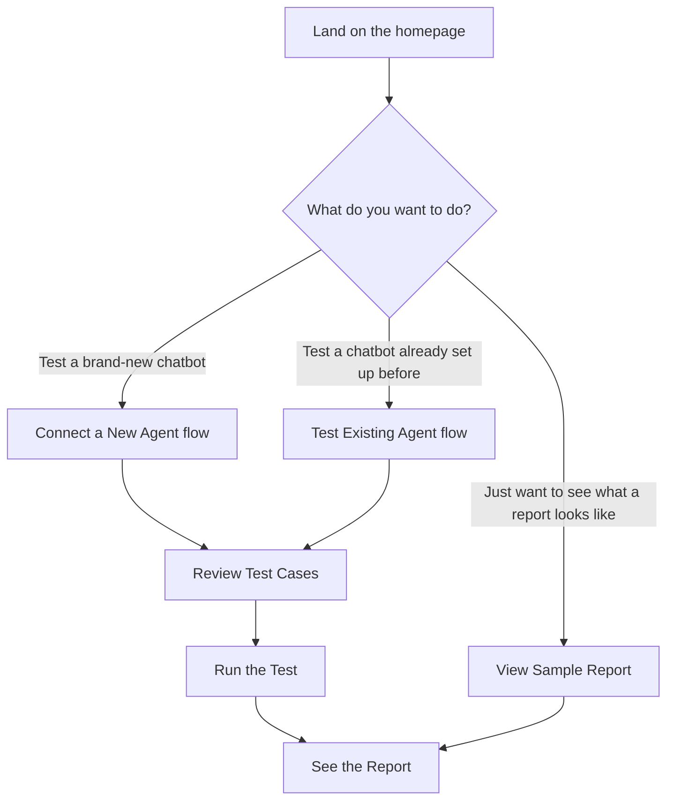

---

## 2. Flow: Connecting a brand-new chatbot

This is the path when someone has their own chatbot and wants to test it for the first time.

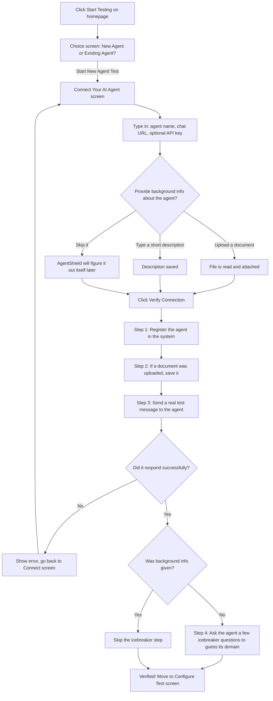

---

## 3. Flow: Picking a chatbot you've already tested before

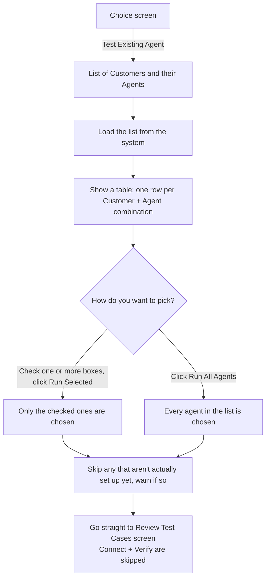

---

## 4. Flow: Loading test cases for the Review screen

This happens automatically right when you land on the Review screen, whichever path got you
there.

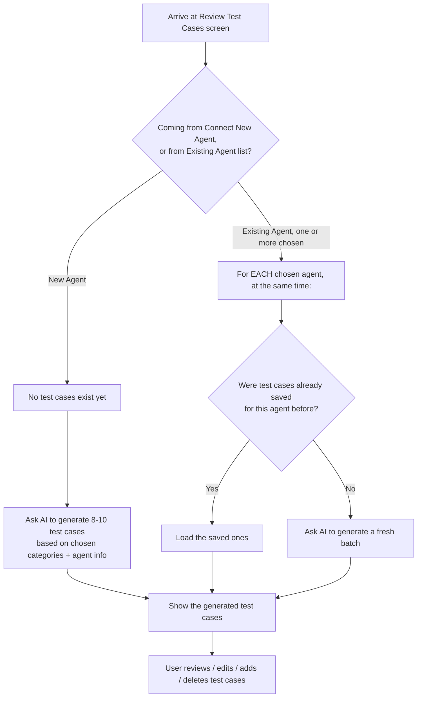

---

## 5. Flow: The Review Test Cases screen in detail

This is the most interactive screen in the app. Here's everything a user can do on it.

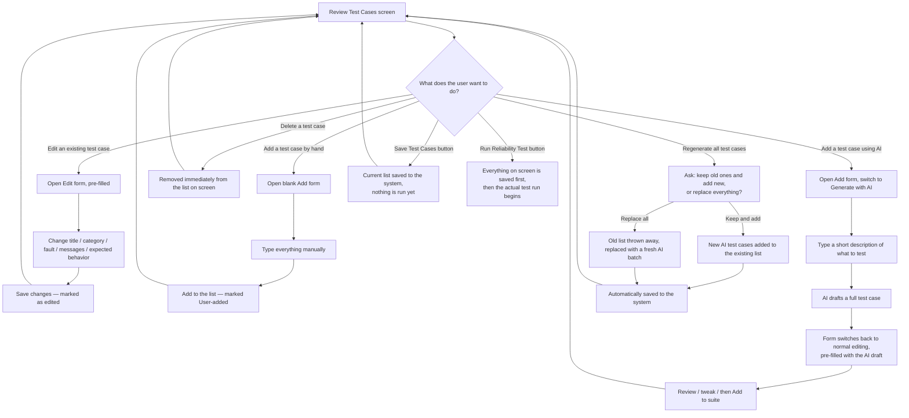

---

## 6. Flow: Running the test (single chatbot)

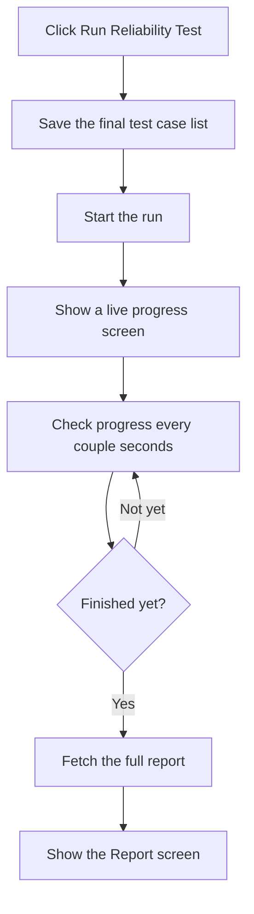

---

## 7. Flow: Running the test on multiple chatbots at once

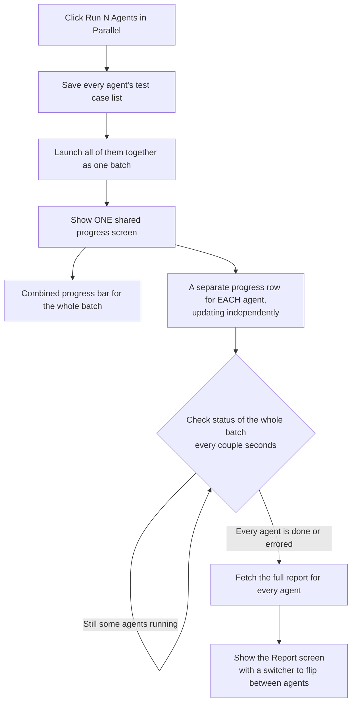

---

## 8. Backend process: how parallel runs are kept from overloading the server

This is *how* section 7 is made safe behind the scenes — the "two bouncers" system that stops
too much work from happening at the exact same moment.

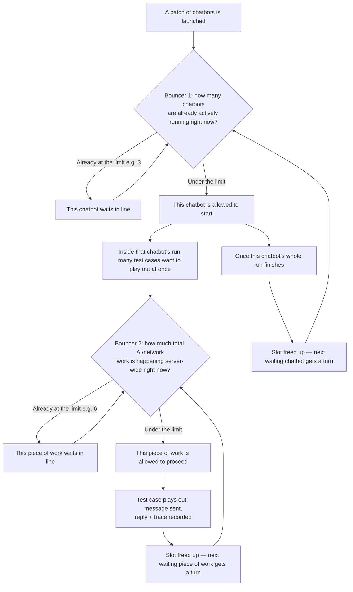

**Why two bouncers and not one:** Bouncer 1 controls how many *chatbots* are active at once.
Bouncer 2 separately controls how much actual *work* (one test case's message, one AI judging
call, etc.) is happening across the **whole server**, no matter how many chatbots are
technically "running." Without Bouncer 2, even a small number of active chatbots could each
try to fire off many test cases simultaneously, silently adding up to far more simultaneous
AI/network calls than intended. Both bouncers are always checked in the same order (chatbot
slot first, then work slot) — checking in a consistent order is what prevents two pieces of
work from getting stuck each waiting on a slot the other one is holding.

---

## 9. Flow: Reading the Report screen

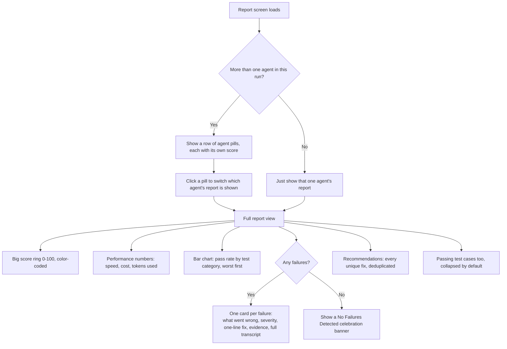

---

## 10. Backend process: what actually happens during one "Run"

This is the behind-the-scenes version of stages 4 and 5 from the guide — what the system does
internally once you click Run, for one single chatbot.

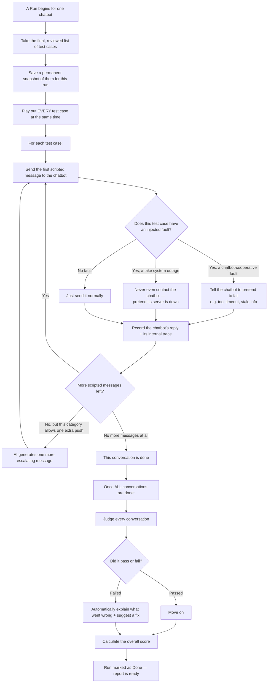

---

## 11. Backend process: judging one conversation

```mermaid
flowchart TD
    A[One finished conversation] --> B{Was this a fake system outage test?}
    B -->|Yes| C[Skip AI judging entirely]
    C --> D[Use a fixed, pre-decided severity and reason<br/>a broken server is never the chatbot's fault]
    D --> Z[Verdict recorded]

    B -->|No| E[Ask the judge AI to score 4 things:<br/>accuracy, safety, hallucination, recovery]
    E --> F{Did the chatbot honestly say<br/>"I don't know" instead of guessing?}
    F -->|Yes| G[That counts as GOOD behavior, not a failure]
    F -->|No| H[Score normally based on what it actually said]
    G --> I[Recalculate the real pass/fail decision<br/>from the 4 scores using fixed rules —<br/>never just trust the AI's own opinion]
    H --> I
    I --> J{Did it fail?}
    J -->|Yes| K[Decide how severe: low, medium, or high<br/>any leaked secret is always High]
    J -->|No| Z
    K --> Z
```

---

## 12. Backend process: turning judged conversations into one score

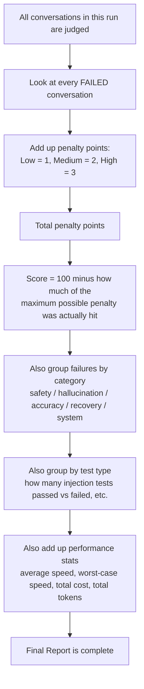

---

## 13. Backend process: connecting a new chatbot (the "black box" handshake)

```mermaid
flowchart TD
    A[User submits: name + URL + optional info] --> B[Save this chatbot as a new entry]
    B --> C{Did the user upload a document?}
    C -->|Yes| D[Attach it permanently to this chatbot's record]
    C -->|No| E[Skip]
    D --> F[Send one real test message to the chatbot's URL]
    E --> F
    F --> G{Did it reply successfully?}
    G -->|No| H[Tell the user the connection failed]
    G -->|Yes| I{Did the user give a description<br/>or upload a document?}
    I -->|No| J[Ask the chatbot 3 neutral icebreaker questions<br/>e.g. "what can you help me with?"]
    J --> K[Show those answers to an AI<br/>and ask it to guess the chatbot's domain]
    K --> L[Save that guess as the description]
    I -->|Yes| M[Skip guessing — info was already given]
    L --> N[Chatbot is fully connected and ready]
    M --> N
```

---

## 14. Backend process: generating test cases

```mermaid
flowchart TD
    A[Request: generate test cases for this chatbot] --> B[Gather everything known about the chatbot:<br/>uploaded docs > written description > auto-guessed description]
    B --> C{Did the user type any special guidance?<br/>e.g. "focus on refund edge cases"}
    C -->|Yes| D[Make sure at least 3 test cases target that guidance]
    C -->|No| E[Skip]
    D --> F[Ask the AI to write 8-10 test cases<br/>covering the requested categories]
    E --> F
    F --> G{Did the AI return at least 4 usable test cases?}
    G -->|No, it failed or returned too few| H[Fall back to a pre-written backup set of test cases]
    G -->|Yes| I[Use the AI's test cases]
    H --> J[Test cases ready for review]
    I --> J
```

---

## 15. How the pieces fit together (very simplified system map)

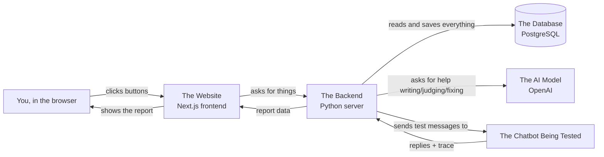

---

## 16. Quick reference: where each flow starts

| If you want to see... | Look at diagram section |
|---|---|
| The very first choice a user makes | Section 1 |
| Connecting your own chatbot for the first time | Section 2 |
| Picking a chatbot you've tested before | Section 3 |
| How test cases get loaded onto the Review screen | Section 4 |
| Everything you can do on the Review screen | Section 5 |
| What happens when you hit Run (one chatbot) | Section 6 |
| What happens when you hit Run (many chatbots) | Section 7 |
| How parallel runs are kept from overloading the server (the "two bouncers") | Section 8 |
| How to read the final Report | Section 9 |
| What the server does during a Run, step by step | Section 10 |
| How one conversation gets judged pass/fail | Section 11 |
| How the final 0-100 score is calculated | Section 12 |
| What happens the moment you connect a new chatbot | Section 13 |
| How test cases are actually written by AI | Section 14 |
| The whole system, zoomed all the way out | Section 15 |
